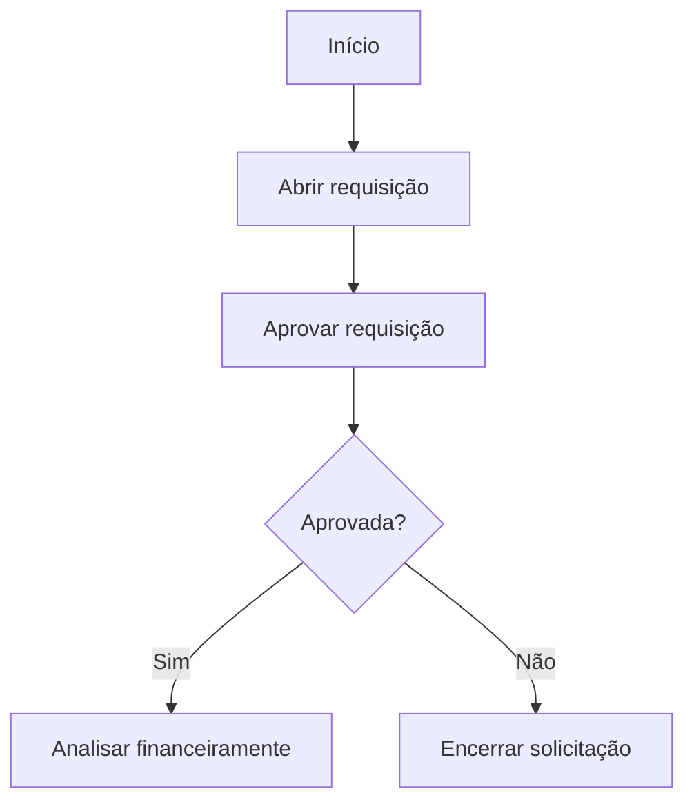

# Orientação Técnica para Construção de um Agente BPMN 2.0

## 1. Objetivo

Este documento descreve uma abordagem para construir um agente especializado em gerar fluxos de processos em **BPMN 2.0** a partir de textos descritivos de processos, utilizando como base:

- especificação técnica BPMN 2.0 da OMG;
- melhores práticas de modelagem de processos;
- exemplos internos de processos validados;
- validação automática de modelos BPMN;
- prompts especializados;
- RAG para recuperação de conhecimento técnico.

A proposta não é simplesmente pedir a uma LLM para “criar um BPMN”, mas organizar um pipeline confiável, validável e orientado a boas práticas.

---

## 2. Ideia central

O agente deve combinar:

```text
RAG sobre especificação BPMN 2.0
+
Prompts especializados
+
Modelo intermediário estruturado
+
Geração de BPMN XML
+
Validação automática
+
Loop de correção
+
Renderização visual
```

A LLM deve ser usada principalmente para interpretação semântica, enquanto regras objetivas, validações e geração de artefatos devem ser tratadas por código sempre que possível.

---

## 3. Arquitetura geral

```text
Texto descritivo do processo
        ↓
Agente BPMN
        ↓
RAG sobre:
- especificação BPMN 2.0 da OMG
- melhores práticas de modelagem
- padrões internos
- exemplos aprovados
        ↓
Modelo intermediário do processo
        ↓
Geração de Mermaid / JSON / BPMN XML
        ↓
Validação sintática e semântica
        ↓
Correção iterativa, se necessário
        ↓
Diagrama final + arquivo .bpmn + relatório técnico
```

O agente não deve gerar diretamente o XML BPMN a partir do texto bruto. É recomendável passar antes por uma representação intermediária estruturada.

---

## 4. Etapas recomendadas do pipeline

### 4.1 Interpretação do texto do processo

A primeira etapa consiste em extrair os principais elementos do processo a partir do texto descritivo.

Exemplo de entrada:

```text
O solicitante abre uma requisição. O gestor aprova. Se aprovado, a área financeira analisa. Caso contrário, a solicitação é encerrada.
```

O agente deve extrair informações como:

```json
{
  "atores": ["Solicitante", "Gestor", "Financeiro"],
  "atividades": [
    "Abrir requisição",
    "Aprovar requisição",
    "Analisar financeiramente"
  ],
  "decisoes": [
    {
      "pergunta": "Requisição aprovada?",
      "opcoes": ["Sim", "Não"]
    }
  ],
  "eventos": [
    "Processo iniciado",
    "Processo encerrado"
  ],
  "entradas": [],
  "saidas": [],
  "sistemas": [],
  "regras_de_negocio": []
}
```

Essa etapa é essencialmente de extração semântica.

---

### 4.2 Normalização para um modelo intermediário

Antes de gerar BPMN XML, recomenda-se criar uma estrutura intermediária em JSON.

Exemplo:

```json
{
  "process_name": "Processo de Aprovação de Requisição",
  "lanes": [
    {
      "name": "Solicitante",
      "steps": [
        {
          "id": "task_abrir_requisicao",
          "type": "userTask",
          "label": "Abrir requisição"
        }
      ]
    },
    {
      "name": "Gestor",
      "steps": [
        {
          "id": "task_aprovar_requisicao",
          "type": "userTask",
          "label": "Aprovar requisição"
        },
        {
          "id": "gateway_requisicao_aprovada",
          "type": "exclusiveGateway",
          "label": "Requisição aprovada?"
        }
      ]
    }
  ],
  "flows": [
    {
      "from": "start_event",
      "to": "task_abrir_requisicao"
    },
    {
      "from": "task_abrir_requisicao",
      "to": "task_aprovar_requisicao"
    },
    {
      "from": "task_aprovar_requisicao",
      "to": "gateway_requisicao_aprovada"
    }
  ]
}
```

Essa camada separa a compreensão do processo da geração técnica do BPMN.

Benefícios:

- facilita validação;
- permite correção antes da geração do XML;
- reduz erros estruturais;
- melhora rastreabilidade;
- permite gerar múltiplas saídas a partir da mesma estrutura.

---

## 5. Uso de RAG com a especificação BPMN 2.0

A especificação da OMG e as boas práticas devem ser transformadas em uma base consultável por RAG.

O objetivo não é enviar a especificação inteira para a LLM, mas recuperar somente os trechos relevantes para cada decisão de modelagem.

### Exemplos de consultas úteis

Quando o processo contém uma decisão como:

```text
Se aprovado, segue para o financeiro; caso contrário, retorna ao solicitante.
```

O agente pode recuperar trechos relacionados a:

```text
exclusive gateway
sequence flow condition
return flow
user task
lanes
```

Quando o texto menciona:

```text
O sistema envia automaticamente um e-mail.
```

O agente pode recuperar conteúdos sobre:

```text
service task
send task
message event
```

Quando o texto menciona:

```text
Aguardar retorno do fornecedor.
```

O agente pode recuperar conteúdos sobre:

```text
intermediate catch event
message event
timer event
```

---

## 6. Estratégia de indexação do corpus

A base vetorial deve ser preparada com metadados úteis para recuperação precisa.

Exemplo de chunk técnico:

```json
{
  "source": "OMG BPMN 2.0 Specification",
  "section": "Gateways",
  "element": "Exclusive Gateway",
  "topic": "decision routing",
  "chunk_type": "technical_definition"
}
```

Exemplo de chunk de boas práticas:

```json
{
  "source": "Internal BPMN Best Practices",
  "topic": "task naming",
  "chunk_type": "modeling_guideline"
}
```

Essa estrutura permite recuperar conhecimento específico, por exemplo:

```text
element: gateway
topic: decision routing
```

em vez de depender apenas de busca textual genérica.

---

## 7. Prompts especializados

O agente deve usar prompts distintos para cada etapa, em vez de um único prompt extenso.

Prompts sugeridos:

```text
extract_process_elements
normalize_to_process_model
select_bpmn_elements
generate_bpmn_xml
validate_bpmn_model
explain_modeling_decisions
```

### Exemplo de prompt para seleção de elementos BPMN

```python
@mcp.prompt()
def select_bpmn_elements(process_description: str, retrieved_context: str) -> str:
    return f"""
    Tarefa: selecionar os elementos BPMN 2.0 mais adequados para representar
    o processo descrito.

    Use como referência apenas:
    - o texto do processo;
    - o contexto técnico recuperado da especificação BPMN;
    - as boas práticas fornecidas.

    Regras:
    - use exclusive gateway apenas para decisões mutuamente exclusivas;
    - use parallel gateway apenas quando atividades ocorrerem em paralelo;
    - diferencie user task, service task e manual task;
    - não crie atores que não estejam presentes ou inferíveis no texto;
    - sinalize ambiguidades em vez de inventar detalhes.

    Texto do processo:
    {process_description}

    Contexto técnico:
    {retrieved_context}

    Retorne JSON com:
    - elementos_bpmn
    - justificativa
    - ambiguidades
    """
```

Esse tipo de prompt é mais robusto do que uma instrução genérica como:

```text
Você é especialista em BPMN. Crie um processo.
```

---

## 8. Separação entre Prompts, Resources e Tools em MCP

Caso a solução seja implementada com MCP, a separação de responsabilidades pode ser feita da seguinte forma.

### 8.1 Resources

Resources expõem conhecimento para leitura:

```text
bpmn_omg_spec_chunks
bpmn_best_practices
organization_modeling_standards
approved_process_examples
bpmn_element_catalog
```

### 8.2 Prompts

Prompts orientam semanticamente a LLM:

```text
extract_process_elements
classify_bpmn_constructs
generate_bpmn_xml
validate_semantic_consistency
explain_bpmn_choices
```

### 8.3 Tools

Tools executam operações objetivas:

```text
search_bpmn_corpus
validate_bpmn_xml
render_bpmn_diagram
convert_intermediate_model_to_bpmn
check_modeling_rules
export_bpmn_file
```

A LLM interpreta e decide. As tools validam, renderizam e exportam.

---

## 9. Validação automática

A validação é uma das partes mais importantes da solução.

### 9.1 Validação sintática

Verificações recomendadas:

```text
XML bem formado
namespaces corretos
IDs únicos
elementos obrigatórios presentes
sequence flows válidos
start event existente
end event existente
```

### 9.2 Validação semântica

Verificações recomendadas:

```text
todo gateway exclusivo tem pelo menos duas saídas
todo fluxo possui origem e destino
não há tarefas órfãs
não há loops acidentais
lanes estão coerentes com os atores
gateways têm rótulos claros
eventos estão adequados ao contexto
```

### 9.3 Validação contra boas práticas

Verificações recomendadas:

```text
nomes de tarefas começam com verbo no infinitivo
gateways são formulados como perguntas
evitar excesso de gateways encadeados
não misturar regra de negócio com nome de tarefa
não criar pools desnecessários
não usar evento quando uma tarefa seria mais adequada
```

---

## 10. Loop de correção

O agente deve trabalhar de forma iterativa.

Fluxo recomendado:

```text
1. Gera modelo inicial
2. Valida o modelo
3. Identifica problemas
4. Corrige o modelo
5. Valida novamente
6. Renderiza
7. Explica decisões
```

Exemplo:

```text
LLM gera BPMN
↓
Tool validate_bpmn_xml encontra erro:
"SequenceFlow aponta para elemento inexistente task_09"
↓
LLM recebe erro
↓
Corrige XML
↓
Valida novamente
```

Esse ciclo reduz bastante a chance de entregar um BPMN inválido.

---

## 11. Formatos de saída recomendados

A geração deve ocorrer em camadas.

### 11.1 Modelo intermediário JSON

Primeira saída estruturada, usada para validação e transformação.

### 11.2 Representação visual simples

Pode ser Mermaid, PlantUML ou outro formato simples.

Exemplo Mermaid:



### 11.3 BPMN XML

Arquivo final interoperável, exportável como `.bpmn`.

### 11.4 Imagem ou SVG

Renderização visual para revisão humana.

---

## 12. Componentes internos do agente

Uma arquitetura adequada pode dividir o agente em subcomponentes.

```text
Process Reader
- extrai atores, tarefas, eventos e decisões

BPMN Mapper
- escolhe elementos BPMN adequados

RAG Retriever
- consulta especificação OMG e boas práticas

BPMN Generator
- gera JSON intermediário, Mermaid e BPMN XML

Validator
- valida XML e regras de modelagem

Reviewer
- aponta ambiguidades e recomenda revisão humana
```

Essa estrutura é adequada para implementação com LangGraph, pois o fluxo envolve etapas, validação e possíveis ciclos de correção.

---

## 13. Papel adequado da LLM

A LLM deve ser usada para:

```text
interpretar linguagem natural
identificar ambiguidades
mapear intenção de negócio para elementos BPMN
explicar decisões de modelagem
sugerir melhorias no processo
```

A LLM não deve ser a única responsável por:

```text
validar XML
garantir conformidade estrutural
renderizar o diagrama
verificar IDs
garantir conectividade do grafo
```

Essas tarefas devem ser resolvidas por código sempre que possível.

---

## 14. Exemplo de fluxo completo

### Entrada do usuário

```text
Quando um colaborador solicita uma compra, o gestor avalia.
Se aprovar, a área de compras faz cotação com fornecedores.
Se não aprovar, a solicitação é encerrada.
Após a cotação, o financeiro valida o orçamento.
Se houver verba, a compra é realizada.
Caso contrário, retorna para revisão.
```

### Saída intermediária esperada

```json
{
  "atores": ["Colaborador", "Gestor", "Compras", "Financeiro"],
  "tarefas": [
    "Solicitar compra",
    "Avaliar solicitação",
    "Realizar cotação",
    "Validar orçamento",
    "Realizar compra",
    "Revisar solicitação"
  ],
  "decisoes": [
    "Solicitação aprovada?",
    "Há verba disponível?"
  ],
  "elementos_bpmn_sugeridos": [
    "startEvent",
    "userTask",
    "exclusiveGateway",
    "endEvent"
  ],
  "ambiguidades": [
    "Não está claro quem revisa a solicitação quando não há verba."
  ]
}
```

### Entregáveis finais esperados

```text
Diagrama BPMN renderizado
Arquivo .bpmn exportável
Modelo intermediário JSON
Relatório de decisões de modelagem
Lista de ambiguidades encontradas no texto
Sugestões de melhoria no processo
Validação técnica do BPMN
```

---

## 15. Recomendações práticas

### 15.1 Evitar geração direta de BPMN XML

Gerar XML diretamente a partir do texto tende a aumentar erros de estrutura, IDs, conexões e semântica.

Melhor abordagem:

```text
Texto → JSON intermediário → validação → BPMN XML → renderização
```

### 15.2 Usar exemplos validados

Além da especificação OMG, inclua exemplos reais de bons modelos BPMN. Isso ajuda a LLM a capturar padrões práticos de modelagem.

### 15.3 Controlar ambiguidades

O agente deve registrar dúvidas em vez de inventar detalhes.

Exemplo:

```json
{
  "ambiguidade": "O texto informa que a solicitação retorna para revisão, mas não informa o responsável pela revisão.",
  "impacto": "Lane de destino indefinida",
  "pergunta_sugerida": "Quem é responsável por revisar a solicitação quando não há verba?"
}
```

### 15.4 Validar antes de entregar

Nenhum BPMN XML deve ser entregue sem validação mínima de:

```text
estrutura
conectividade
gateways
eventos
lanes
nomenclatura
```

### 15.5 Manter rastreabilidade

Cada decisão de modelagem deve poder ser explicada:

```json
{
  "elemento": "exclusiveGateway",
  "motivo": "O texto descreve uma decisão mutuamente exclusiva: aprovado ou não aprovado.",
  "evidencia_textual": "Se aprovar... Se não aprovar..."
}
```

---

## 16. Conclusão

Para construir um agente especializado em BPMN 2.0, a melhor abordagem é combinar conhecimento técnico recuperável, prompts especializados, modelo intermediário, validação automática e ciclos de correção.

A solução ideal não deve depender apenas da capacidade generativa da LLM. Ela deve usar a LLM para interpretar e decidir, mas usar código e ferramentas para validar, transformar, renderizar e exportar.

Síntese da abordagem:

```text
RAG para conhecimento técnico
+
Prompts especializados por etapa
+
Modelo intermediário estruturado
+
Tools de validação BPMN
+
Loop de correção
+
Renderização visual
```

Essa arquitetura transforma o agente em uma ferramenta útil para analistas de processos, capaz de gerar modelos BPMN mais consistentes, rastreáveis e alinhados à especificação BPMN 2.0.
